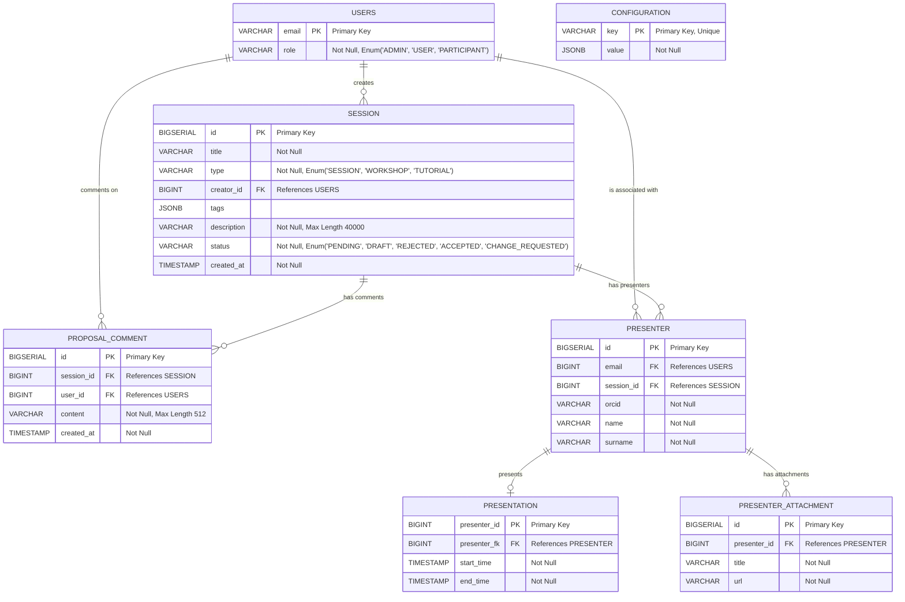

# Confero - Conference Management System

## Database Schema

```mermaid
erDiagram
    USERS {
        VARCHAR email PK "Primary Key"
        VARCHAR role "Not Null, Enum('ADMIN', 'USER', 'PARTICIPANT')"
    }

    SESSION {
        BIGSERIAL id PK "Primary Key"
        VARCHAR title "Not Null"
        VARCHAR type "Not Null, Enum('SESSION', 'WORKSHOP', 'TUTORIAL')"
        BIGINT creator_id FK "References USERS"
        JSONB tags
        VARCHAR description "Not Null, Max Length 40000"
        VARCHAR status "Not Null, Enum('PENDING', 'DRAFT', 'REJECTED', 'ACCEPTED', 'CHANGE_REQUESTED')"
        TIMESTAMP created_at "Not Null"
    }

    PROPOSAL_COMMENT {
        BIGSERIAL id PK "Primary Key"
        BIGINT session_id FK "References SESSION"
        BIGINT user_id FK "References USERS"
        VARCHAR content "Not Null, Max Length 512"
        TIMESTAMP created_at "Not Null"
    }

    PRESENTER {
        BIGSERIAL id PK "Primary Key"
        BIGINT email FK "References USERS"
        BIGINT session_id FK "References SESSION"
        VARCHAR orcid "Not Null"
        VARCHAR name "Not Null"
        VARCHAR surname "Not Null"
    }

    PRESENTATION {
        BIGINT presenter_id PK "Primary Key"
        BIGINT presenter_fk FK "References PRESENTER"
        TIMESTAMP start_time "Not Null"
        TIMESTAMP end_time "Not Null"
    }

    PRESENTER_ATTACHMENT {
        BIGSERIAL id PK "Primary Key"
        BIGINT presenter_id FK "References PRESENTER"
        VARCHAR title "Not Null"
        VARCHAR url "Not Null"
    }

    CONFIGURATION {
        VARCHAR key PK "Primary Key, Unique"
        JSONB value "Not Null"
    }

    %% Relationships
    USERS ||--o{ SESSION : "creates"
    USERS ||--o{ PROPOSAL_COMMENT : "comments on"
    USERS ||--o{ PRESENTER : "is associated with"
    SESSION ||--o{ PROPOSAL_COMMENT : "has comments"
    SESSION ||--o{ PRESENTER : "has presenters"
    PRESENTER ||--o| PRESENTATION : "presents"
    PRESENTER ||--o{ PRESENTER_ATTACHMENT : "has attachments"
```