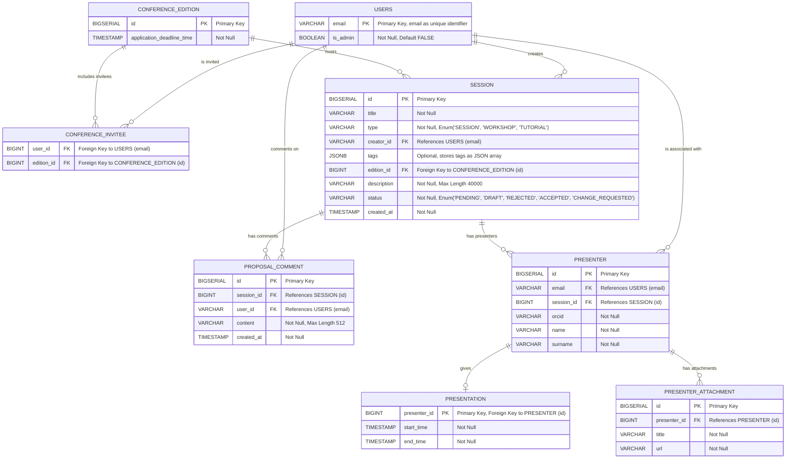

# Confero - Conference Management System

## Database Schema

### OpenAPI code generation

The same OpenAPI specification file is used to generate type-safe client and server API code for both `ui` and `api`. The file is located at `confero-api/src/main/resources/openapi.yaml`.

Swagger UI is available at `api/swagger`.